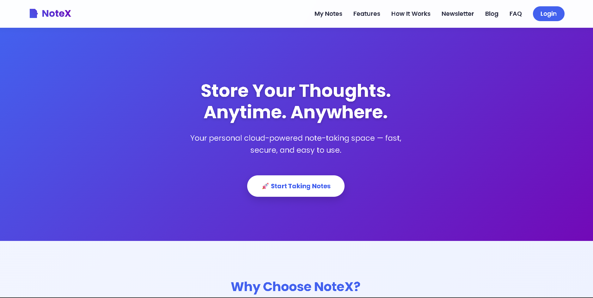

<!-- Fancy Banner -->

  

<!-- Badges -->

  
  
  

---

<h2 align="center">  About NoteX</h2>

NoteX is a **modern, minimal, and blazing fast** note-taking web app built with Firebase for storage.  
Easily note down ideas, manage your thoughts, and keep them synced securely in the cloud.

---

<h2 align="center"> 🛠 Tech Stack</h2>

---

<h2 align="center">✨ Features</h2>

<ul>
  <li>📝 Create, edit, and delete notes</li>
  <li>☁ Cloud sync with Firebase</li>
  <li>📱 Mobile-friendly design</li>
  <li>🔒 Secure authentication</li>
  <li>⚡ Lightning-fast performance</li>
</ul>

---

<h2 align="center">App Preview</h2>

  

---

<h2 align="center"> How to Use This Project</h2>

<ol>
  <li><strong>Clone the repository</strong>
    <pre><code>git clone https://github.com/adinahawaldar/NoteX.git</code></pre>
  </li>
  
  <li><strong>Open the project folder</strong>
    <pre><code>cd NoteX</code></pre>
  </li>
  
  <li><strong>Open the <code>index.html</code> file</strong> in your browser to run the project locally.</li>
  
  <li><strong>Edit the files</strong> (<code>index.html</code>, <code>style.css</code>, <code>script.js</code>) to customize the project as you wish.</li>
  
  <li><strong>Enjoy!</strong> 🎉</li>
</ol>

<h3 align="center">📜 License</h3>

This project is licensed under the <a href="LICENSE">MIT License</a> — you are free to use, modify, and distribute it with proper credit.

<h3 align="center">🤝 Contributing</h3>

Contributions are welcome! Please fork the repository and create a pull request for any changes you’d like to make.

---

## <h2 align="center">📬 Connect with Me</h2>

  
  
  
  

